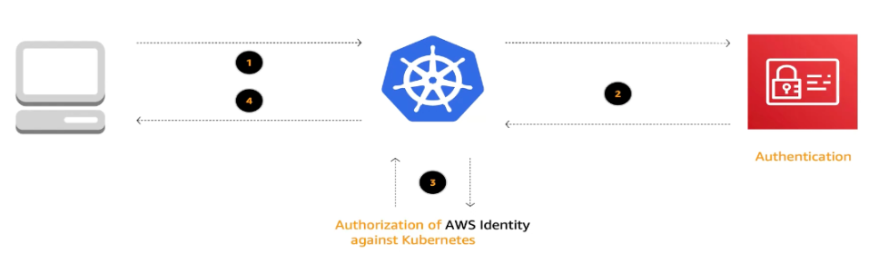

# [Amazon EKS - Knowledge Badge Readiness Path](https://explore.skillbuilder.aws/learn/lp/1931/amazon-eks-knowledge-badge-readiness-path)
Espacio para anotar los detalles que me parezcan mas importantes del curso. Ya que tengo conocimiento previo en Kubernetes, no anotaré los conceptos básicos de este.

## Test Previo
- Which AWS service can you use to troubleshoot EKS Control Plane logs? **CloudWatch Logs**
> [!NOTE] 
> `Container Insights` summarizes metrics and logs for Containerized applications. **EKS Control Plane logs are not collected by CloudWatch container Insights**.
- **Container Isolation - Namespaces:** feature del kernel de Linux que permite limitar los procesos a los que tiene acceso otro proceso
- **Container Isolation - cgroups:** feature del kernel de Linux que permite limitar los recursos (cpu, memoria, disco I/O, network, etc) a los que tiene acceso un proceso

## Ruta de aprendizaje
### Infra
- `EKS` despliega por ti el **control plane** que consta de 2 instancias EC2 con la API, Scheduler, etc y otras 3 instancias para `etcd`
- `stateful` objeto de kubernetes pensado para aplicaciones que no pueden ser efímeras como una DB. Para garantizar la persistencia entran en juego los conceptos de `Persistent Volume Claim (pvc)` y `Persistent Volume (pv)`, el primero es la petición que hace kubernetes para solicitar un recurso de almacenamiento (local, EBS, EFS, etc) y el segundo es el recurso en sí, el volumen que montaremos en nuestro pods
> [!NOTE]
> `ReplicaSets` comparten un PVC con todos los pods definidos en este mientras `StatefulSets` crea un PVC por pod
- `Liveness, Readiness and Startup Probes` nos permiten configurar health checks nativos de kubernetes para verificar el estado de una aplicación a los cuales podemos añadir lógica en base a condiciones como reiniciar el pod en base a X fallos, etc
- La **Autenticación** y **autorización**, funciona de la siguiente forma:

- El concepto de `ServiceAccount` en Kubernetes se utiliza principalmente para definir los permisos y la identidad de los pods dentro del clúster, es decir, para la gestión de permisos de "dentro hacia afuera". Para la asociación de permisos a usuarios externos como testers, desarrolladores, etc., se utilizan otros mecanismos de autenticación y autorización que pueden ser gestionados a nivel de `IAM (Identity and Access Management)` en la nube donde se ejecuta el clúster de Kubernetes o a través de otros sistemas de gestión de identidades.

### Networking
- `service` solo operan en la `capa 4` manejando tráfico `TCP/UDP`. Los puertos definidos en `service` se definen a nivel de `namespace` por lo que podríamos usar el mismo número de puerto en diferentes `namespaces`
    - `NLB (Network Load Balancer)` vínculado a los `service`
    - `ALB (Application Load Balancer)` vínculado a los `ingress` controller operan en capa 7
        - `Ingress` tráfico que hacia el pod
        - `Egress` tráfico que desde el pod
- `network policies` son reglas que controlan el tráfico de red entre los pods dentro de un clúster y con redes externas. Estas políticas definen qué conexiones están permitidas o denegadas basándose en criterios como etiquetas de `pods`, `namespaces`, y `puertos`. Implementadas a través de objetos de tipo `NetworkPolicy`, permiten especificar reglas de entrada (`ingress`) y salida (`egress`) que determinan cómo y desde dónde puede fluir el tráfico hacia los pods. Al aplicar estas políticas, los administradores pueden mejorar la seguridad del clúster, restringiendo el acceso solo a las aplicaciones y servicios autorizados, y reduciendo la superficie de ataque potencial.

### Observability
- `MTTI (Mean Time To Idenfity)` engloba el tiempo desde que detectamos una fallo (ticket, alerta, etc) hasta que lo identificamos (analizamos trazas, logs de error, etc)
- `MTTR (Mean Time to Resolve)` engloba el anterior punto además del tiempo de solventar el problema y su previa verificación
- `Amazon CloudWatch` es la herramienta cloud native que amazon propone como herramienta de telemetría y logs para el `Control Plane` de EKS. Este permite recolección de logs a nivel de api server, scheduler, authenticator, audit o controllerManager
    - `CloudWatch Logs Insights` nos permite realizar consultas directamente sobre nuestros logs para facilitar la explotación de estos
    - `CloudWatch Logs` utiliza un agente de `fluentbit` desplegado en cada nodo de clúster para la obtención de logs de los pods.
    - `CloudWatch Container Insight` utiliza `CloudWatch agent` desplegado en cada nodo para recolección de métricas del rendimiento o recursos usados (consumo de CPU, memoría, etc) por los servicios desplegados
- `Amazon X-Ray` proporciona herramientas para rastrear las solicitudes a través de las distintas partes de la aplicación, identificando cuellos de botella y problemas de rendimiento. Recopila datos sobre las solicitudes a medida que se propagan a través de los diferentes componentes del servicio (LoadBalancers, DB, etc) que nos permite obtener una visión detallada de la latencia, identificar errores y optimizar el rendimiento de las aplicaciones.

### Autoscaling
- [`Horizontal Pod Autoscaler (HPA)`](https://kubernetes.io/docs/tasks/run-application/horizontal-pod-autoscale/) objeto de Kubernetes que podemos definir para que escale horizontalmente **nuestros pods** ante un evento o un threshold definido
    - Usando `metric server` realizando consultas a `kubelet` de cada nodo
    - Usando `Prometheus Adapter` usando las métricas del propio Prometheus para realizar el escalado
    - Usando `KEDA` usando eventos para realizar el escalado
- [`Cluster Autoscaler (CAS)`](https://kubernetes.io/docs/concepts/cluster-administration/cluster-autoscaling/) la idea es similar a la anterior, pero desde el punto de vista de los nodos, es decir, permite crear nuevos nodos en base a la carga de nuestro cluster
    - Usando [`Karpenter`](https://karpenter.sh/) sin necesidad de mucha configuración adicional
        1. Analiza los pods que no se puede desplegar
        2. Analiza es listado de tipos de nodos que permitimos desplegar
        3. Despliega la instancia con menor coste para satisfascer el despliegue de estos pods
        4. Analiza constantemente si puede consolidar los pods existentes en los nodos desplegados con el fin de tener el mínimo de nodos posibles
> [!NOTE]
> Puedes definir diferentes agentes de provisioning y asignarles pesos para que priorice el uso de los de menor peso
- **Reducción de costes** depende del tipo de instancia que usemos en nuestros nodos, puede suponer una gran reducción de costes
    - `On-demand Instances` pagamos por el tiempo de uso de la instancia y es aprovisionada en el momento que la necesitemos. Pensadas para cargas de trabajo variables
    - `Saving Plans` cerramos un precio concreto por un o grupo de instancias con recursos prefijados. Ideal para cagas de trabajo fijas
    - `Spot Instances` similar a las instancias `on-demand` con la salvedad de estas instancias "no nos pertenecen", es decir, si algún cliente `on-demand` necesita nuestra instancia AWS nos matará la instancia y nos dará otra. El tiempo de preaviso para esta operación es de 2min, por lo que nuestra aplicación tiene que ser tolerante a fallos si usamos esta configuración. Supone un ahorra del 90% frente a las `on-demand`
- [`KubeCost`](https://www.kubecost.com/) aplicación que podemos desplegar en nuestro cluster que nos da un reporte de costes de nuestro cluster a nivel de namespace, pod, etc. Ya que no existe una forma de nativa de explorar costes con cierta granularidad en un cluster de kubernetes, `kubecost` es una buena opción

## GitOps
Repositorios Git como fuente de verdad. Cualquier cambio en estos, desencadenará un flujo de CI/CD para desplegar/actualizar los recursos necesarios en nuestro cluster de kubernetes. Algunas de las herramientas más populares son: `Flux` o `ArgoCD`. Adcionalmente, cabe destacar `Kustomize` herramienta de templating que nos permite tener plantillas para la definición de nuestro recursos

> [!TIPS]
> Para configurar las credenciales del clúster de una pipeline de **GitHub Actions** habilitando la implementación de microservicios en un clúster de EKS:
> 1. Almacenar la `AWS Access Key` y `Secret Key` de AWS como secretos en el repositorio de GitHub
> 2. Configurar variables de entorno para usar estos secretos junto con los detalles del clúster de EKS (nombre, región) para conectarse al clúster de EKS

### Aplicaciones
- Los pasos a tener en cuenta cuando queremos desplegar una app en nuestro cluster de kubernetes mediante `raw manifest` son:
    1. Definir de forma declarativa, vía yaml, los aspectos de nuestra aplicacion: qué imagen usará, cuantas replicas queremos de esta, que puerto necesita exponer, etc. Toda esta configuración estará definida en el objeto `Deployment` de kubernetes
    2. Definir el networking interno. Similar al punto anterior de forma declarativa definiremos los puertos a usar definiendo un `service`
    3. Para exponer nuestra aplicación al exterior definiremos un objecto `Ingress` en donde asociaremos diferentes path a los `services` que gestionan el tráfico de nuestra aplicación
- Otro enfoque sería crear un paquete `Helm` para nuestra aplicación
- Podemos realizar análisis de seguridad de forma estática con herramientas como [`hadolint`](https://github.com/hadolint/hadolint) o análisis en runtime con servicios como [`GuardDuty`](https://aws.amazon.com/es/guardduty/) activando `AuditLogs` en nuestro cluster EKS

## Comentarios extra:
Algunos test tiene fallos, que he reportado a Amazon como los puntos:
- In the question, *"If you want to select the AMI of your nodes, which node group type would you select?"*, both Managed node groups and Self-managed node groups are correct answers as shown in the previous videos: "Let's go ahead and create a managed node group. I'll click on 'add node group,' and I'll call this my EC2 node group one."
- The same issue occurs in the question, "Which AMI type was built specifically for containerized workloads?" Bottlerocket is the correct answer instead of Amazon Linux 2, as demonstrated in the video: "I will choose Bottlerocket because Bottlerocket is an operating system built by Amazon specifically for containerized workloads."

Algunas respuestas de los tests:
- StatefulSets make sure that Pods `Retain their name/identity` after being rescheduled.
- What is a Helm chart? `The fundamental unit used to package application resources and dependencies`
- A Kubernetes Ingress can proxy traffic to one or more Services using which of the following? `Routing rules`
- What is the hard security boundary in an Amazon EKS cluster? `The cluster`
- Which of the following integrates File Storage with Amazon EKS? `Amazon EFS CSI Driver`
- Which of the following applies to K8s secrets by default? `Encoded`
- What Amazon service was integrated with Amazon ECR to enable customers to scan container images for security vulnerabilities? `Amazon Inspector`
- A Service of type LoadBalancer will by default create a __________ `Classic Load Balancer` (ELB)
- The Network Load Balancer is configured with which of the following? `Annotations`
- A Kubernetes Service selects Pods using _______ `Labels`
- What does a 'trace' typically represent in observability? `The entire lifecycle of a request`
- Which query language is used by Amazon Managed Service for Prometheus? `PromQL`
- What does a 'trace' typically represent in observability? `The entire lifecycle of a request`
- What is observability? `The ability to understand the state of a system from its outputs`
- Within a single node group, when using Cluster Autoscaler, It's best practice to use instance types with a range of different CPU and memory specifications (true/false) `false` porque mezclar diferentes tipos de instancias dentro de un solo node group complica el proceso de escalado automático, hace menos predecible la disponibilidad de recursos y dificulta la optimización del uso de recursos. La práctica recomendada es mantener la homogeneidad de los nodos dentro de cada node group.
- The _______ pattern can be used to ensure we always have an amount of spare capacity in the data plane. `Over-provisioning`
- Karpenter's ________ feature intelligently launches cheaper instances to more densely pack existing pods reducing costs. `Consolidation`
- Which of the following is a key principle of GitOps? `Declarative infrastructure as code`
- In GitOps, where is the desired infrastructure and application state defined? `In a separate Git repository`
- Which Flux component is responsible for reconciling the desired state from Git with the actual state in a Kubernetes cluster? `Flux Operator`

